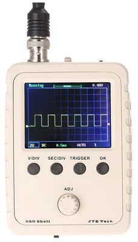

- Данный осцилограф является усовершенствованной версией ранее расмотренного DSO138.
- Из отличий от предыдущей версии более широкая характеристика чувствительности, а именно 5mV/div - 20V/div в то же время DSO138 имеет 10mV/div - 5V/div. А также отличается формат исполнения платы, теперь расположение элментов экрана и измерительной схемы располагаются на одной плате [[18]].
- Также стоит отметить, что устройство довольно большое, его габариты составляют 115мм х 75мм х 22мм
- Собранная версия DSO Shell представлена на рисунке.
- 