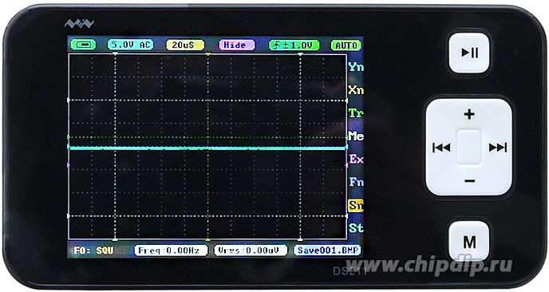

- Портативный цифровой одноканальный осциллограф MiniDSO DS211 от компании Miniware.
- Данный осцилограф обладает частотой пропускания в 200 кГц, и максимальным входным напряжением в 40 В [[22]] .
- Из дополнительных функций данная плата позволяет применять математические операции над измеренной величиной в реальном времени.
- Также обладает широким выбором по экспортированию измерененных данных, измеренные данных можно представить в виде BMP, DAT, BUF, CSV, SVG форматов. По-мимо экспорта на данном осцилографе можно импортировать и просматривать ранее измеренные данные, это может потребоваться в случаях, когда измеренную ранее величину сравнивают с текущим данными.
- К плюсам можно отнести простой способ взаимодействия с осцилографом, на плате выведены всего 6 основных кнопок из-за чего MiniDSO DS211 не выглядит перегруженно в сравнении с предыдущими платами.
- По сравнению с остальными рассмотренными решениями данный осцилограф обладает наименьшеми размерами габаритов вместе с корпусом, а именно 106 х 55.5 х 11 мм.
- Внешний вид устройства предствлен на рисунке.
- 