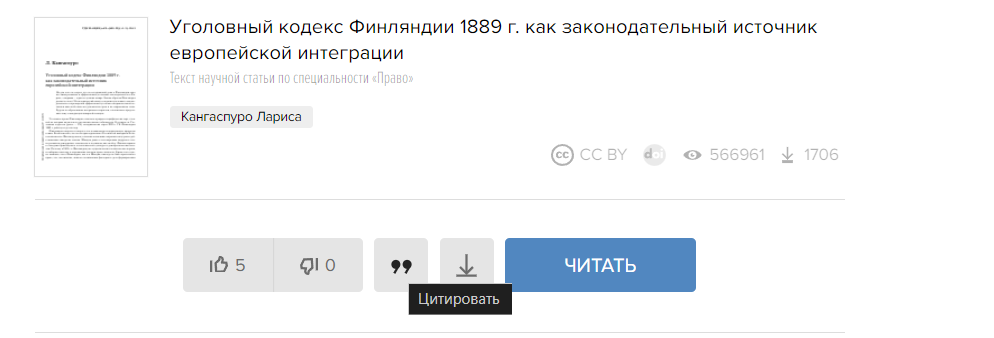

- Сервисы для поиска:
	- [Google Scholar](https://scholar.google.com/) - для статей (рус англ)
	- [elibrary](https://elibrary.ru/defaultx.asp?) - для статей (но некоторые ссылки google scholar) требует бесплатной регистрации, не все стаьи можно открыть бесплатно
	- [CyberLeninka](https://cyberleninka.ru/) - без реги, все статьи доступны
		- 
		- 
		- Взрыв мозга
	- [Яндекс.Патент](https://yandex.ru/patents) - для поиска патентов СССР, РФ
	- [Google patents](https://patents.google.com/) - для пендоских
	- [Sci Hub](https://sci-hub.hkvisa.net) - для профессиональных воришек