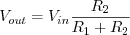

- Изменение входного напряжения, выраженного математической функцией деления, в электронной схемотехнике возможно реализовать двумя способами. Первый - делитель на основе резистивных элементов и второй - делитель на основе операционныого усилителя. Так как второй способ в данной работе не используется, в данном разделе он не рассмотрен.
- Принцип работы делителя на основе резистивных элементов заключается в том, что входное напряжение распределяется между элементами схемы [[14]] .
- 
- В общем виде данная схема выражается по формуле:
- 
- Используя данный делитель можно получить несколько напряжений, используя один источник питания. Также к преимуществам данной схемы относится дешевизна, так как стоимость компонентов значительно дешевле микросхем операционных усилителей.