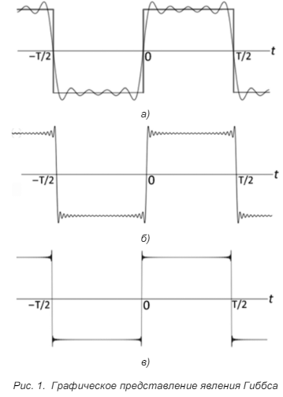

- Одним из важных методов при обработке цифровых сигналов является преобразование Фурье. Преобразование Фурье переводит дискретный или непрерывный сигнал из временной в частотную область (по оси x вместо времени t следует откладывать частоту ω), причем полученные коэффициенты имеют комплексный вид. Модуль этих коэффициентов показывает распределение амплитуд по частотам в сигнале, а аргумент – распределение фазовых сдвигов по частотам.
-
- Для обработки серии дискретных значений для некоторого сигнала часто применяются цифровые фильтры. В сущености они являются некоторым математическим выражением, применив которое к серии данных можно получить копию измеренного сигнала, в которой подавлена та или иная область частот. Такие фильтры можно реализовать и аппаратно, так же, как и аналоговые, но из-за растущей сложности структуры с увеличением порядка чаще прибегают к программной реализации фильтра, и уже программу записывают в некое вычислительное устройство, обрабатывающее входной сигнал [[10]] .
- Такие фильтры можно реализовать и аппаратно, так же, как и аналоговые, но из-за растущей сложности структуры с увеличением порядка чаще прибегают к программной реализации фильтра, и уже программу записывают в некое вычислительное устройство, обрабатывающее входной сигнал.
- Основной характеристикой таких фильтров является импульсная характеристика:
	- 
- При проектрировании нерекурсивных фильтров также стоит брать во внимание проблему эффекта Гиббса. Явление Гиббса состоит в том, что в случае ограничении числа членов ряда Фурье для функции с разрывами первого рода возникают затухающие колебательные процессы около мест разрыва [[11]] .
	- 
- Эта проблема решается либо проектированием фильтра с более плавной АЧХ в местах разрывов, либо увеличением порядка фильтра (тогда пульсации остаются, но их амплитуда во много раз меньше), либо проектированием такой АЧХ, чтобы подавляемая частота точно попадала в одно из значений.