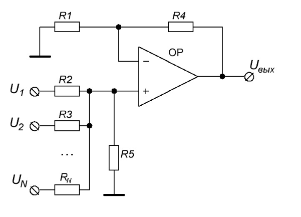
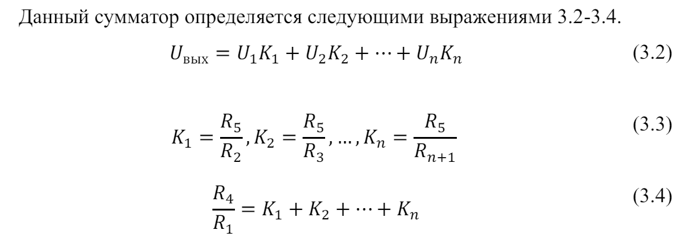

- Для аддитивной операции для некоторого заданного сигнала с другим сигналом в схемотехнике существует схема неинвертирующего сумматора сигналов.
- На каждый из входов c U1..Un подаются напряжения, в данном случае эти сигналы являются слагаемыми. Операционный усилитель в данном случае суммирует имеющиеся сигналы и выдаёт на выход Uвых результат суммирования напряжений сигналов [[16]].
- 
- 
-
-