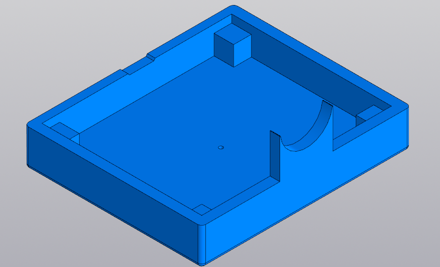
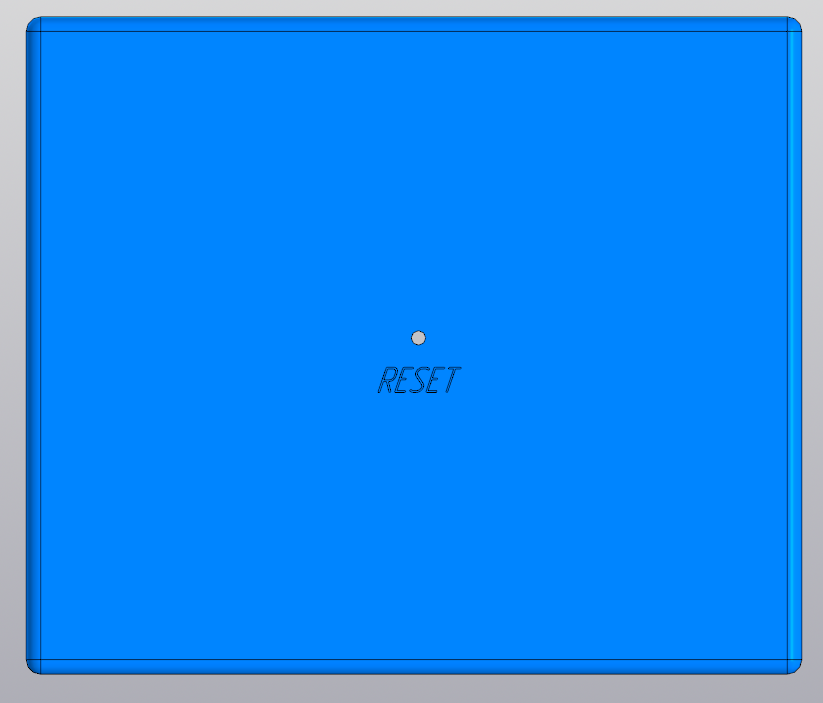
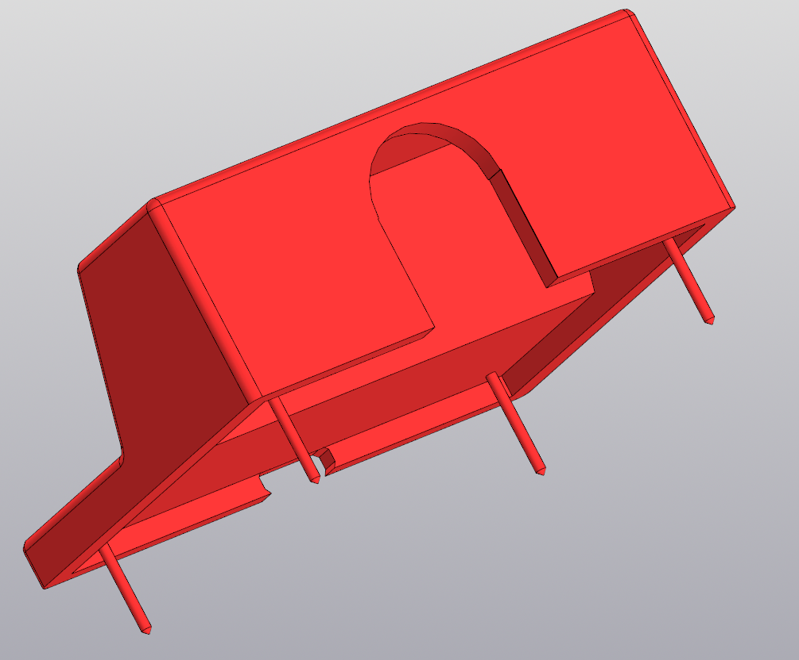
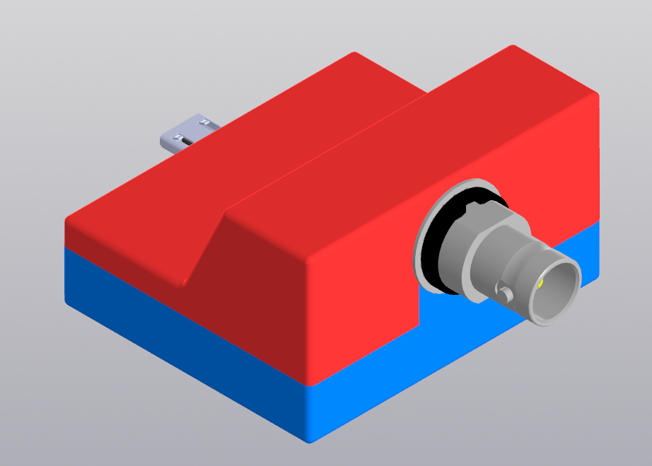
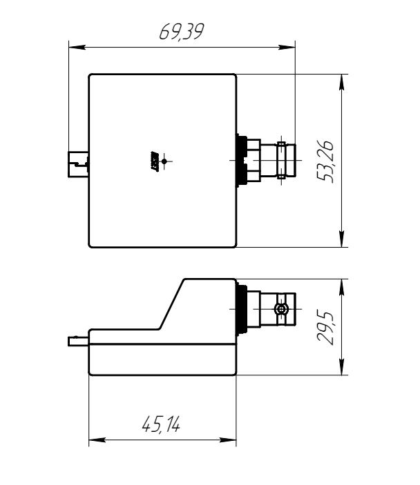

- На основе 3D модели платы из предыдущего раздела создан корпус устройства.
- Данный корпус состоит из двух частей. Первая часть является поддоном, в неё устанавливается плата по направлению с BNC разъёмом.
- 
-
- На обратной стороне данного поддона имеется отверстие под булавку с пояснением, что данное отверстие нужно для перезагрузки устройства. Функция перезагрузки платы исполнена именно в таком виде, потому что не предполагается её постоянное использование и также в таком варианте исключается возможность случайного задевания этой кнопки пользователем.
- 
-
- Верхняя часть корпуса крепится в поддон через отверстия в плате, используя штыри по углам корпуса, таким образом сборка устройства происходит без использования резъбовых крепежей.
- В районе BNC соединителя плоскость занимает всё пространство от левого до правого края корпуса, сделано это для большей устойчивости устройства ввода/вывода данных за счёт большей плоскости упора. Это поможет в тех случаях когда устройство пользователя обладает перевёрнутым micro USB входом.
- 
-
- Корпус устройства в сборе вместе с платой представлен на рисунке
- 
-
-
- Габариты устройства представлены на рисунке
  id:: 6643b3d2-dbd5-4664-a6b5-57d0a078e533
- 