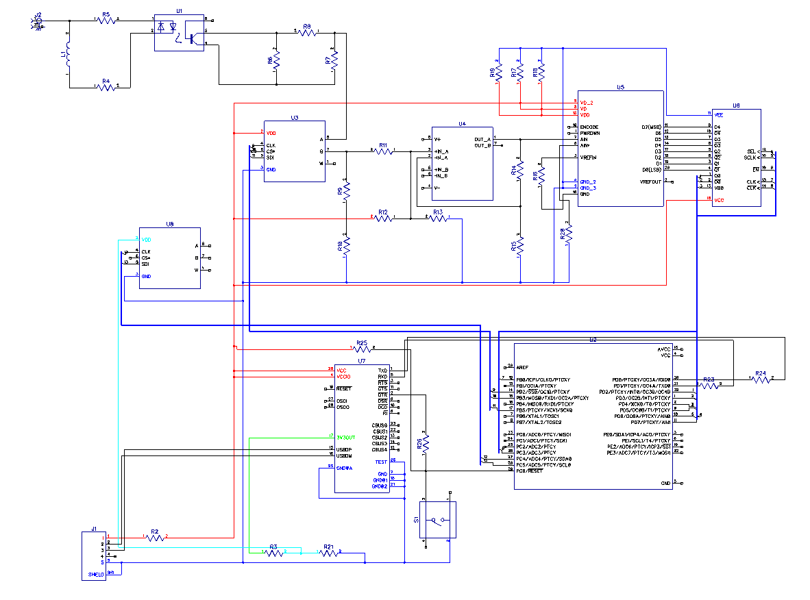
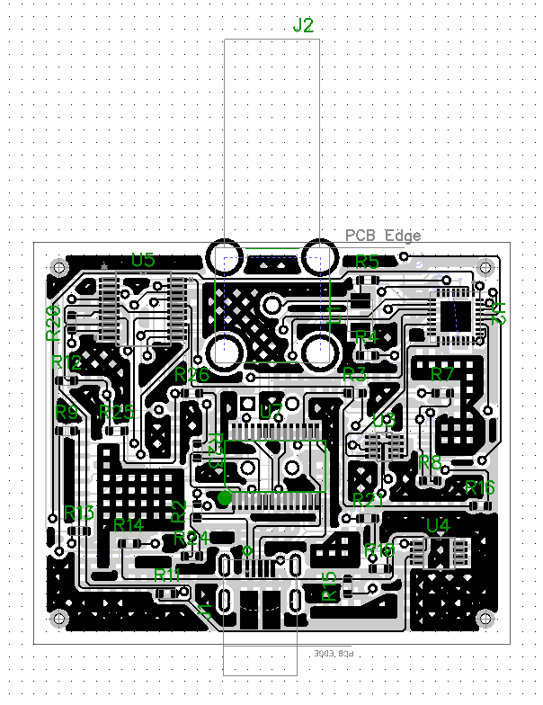
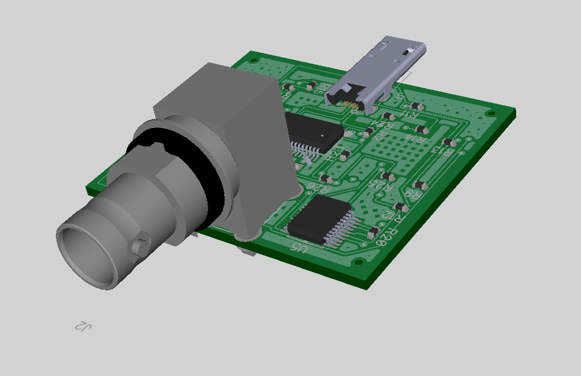

- При разработке печатной платы использовалась программное обеспечение DipTrace.
- Приложение позволяет трассировать пути от элемента к элементу в автоматическом режиме, но для этого необходимо иметь принципиальную схему подключения. Поэтому схема из предыдущего раздела переведена в DipTrace формат. Также стоит упомянуть, что схема в DipTrace отличается некоторыми микросхемами, к примеру, программируемый генератор тактов здесь представлен точно также как и программируемый потенциометр. Сделано так по той причине, что на репозитории элементов SnapEDA нет информации о том, что это за плата, какая у неё 3D модель, распиновка и размеры, но так как эти платы исполнены в одной и той же цоколёвке 20-SOIC они являются взаимозаменямыми, поэтому достаточно соединить их на те же выводы, что и у нужной платы.
- 
-
- Далее полученная схема переводится в трассировщик путей. По техническому заданию данное устройство должно быть максимально компактным, поэтому все элементы располагаются вблизи друг от друга и равномерно распределны относительно оси центра между micro USB и BNC соединителем.
- Также из-за компактности данная плата содержит 7 слоёв для сигнальных дорожек, так как ко многим элементам требуется сразу несколько подключений на один вывод, к примеру вывод PB5/SCK у микроконтроллера.
- 
-
- На рисунке представлена плата в 3D представлении
- 