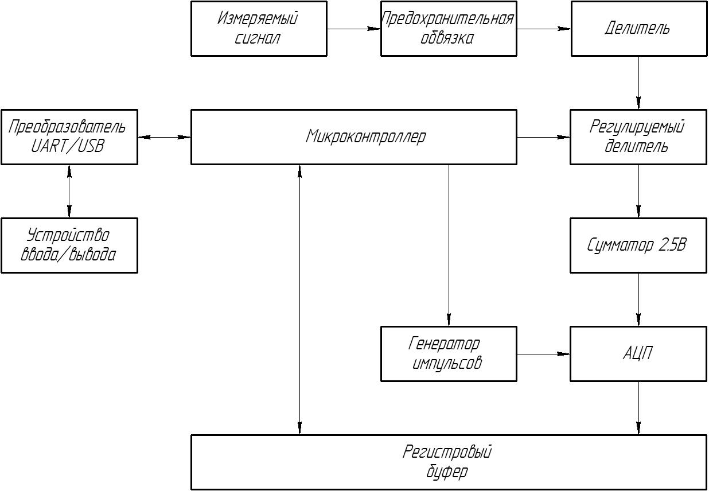

- Измерение сигнала напрямую сопровождается тем, что в случае нарушения нормальной работы устройства внешними факторами, из строя может могут выйти дорогостоящие компоненты измерительного устройства. Поэтому измерение сигнала происходит не напрямую, а через прослойку в виде предохранительной обвязки, и в случае нарушения работы из строя будет выведена именно эта прослойка, а не другие части.
- Как было указано выше, самым простым вариантом измерения сигналов больших максимального входного напряжения аналогово-цифрового преобразователя – это использование схем делителей, для преобразования входного сигнала. Это же касается регулируемого делителя, поэтому перед ним устанавливается обычный делитель.
- Для измерения частоты дискретизации миконтроллерможет изменять частоту генератора тактовых импульсов.
- После двух делителей сигнал идёт на сумматор, так как предполагается использование АЦП, которое может мерить только однополярные напряжения в с пределом измерения 5В.
- Для синхронизации работы маломощного микоконтроллера и АЦП с выскокой частотой дискретизации вывод АЦП подключается с регистровым буфером, который в соответствии с частотой миконтроллера выдаёт данные на миконтроллер в виде битовых значений.
- Через микронтроллер измеренные данные передаются пользователю через преобразователь интерфейсов UART/USB, где пользователь может взаимодействовать с ними. Также для регулировки регулируемого делителя
-
- Портативное АРМ - автоматизированное рпабочее место
- 
  id:: 6640b35c-b07e-46c0-82a9-5834aa841947