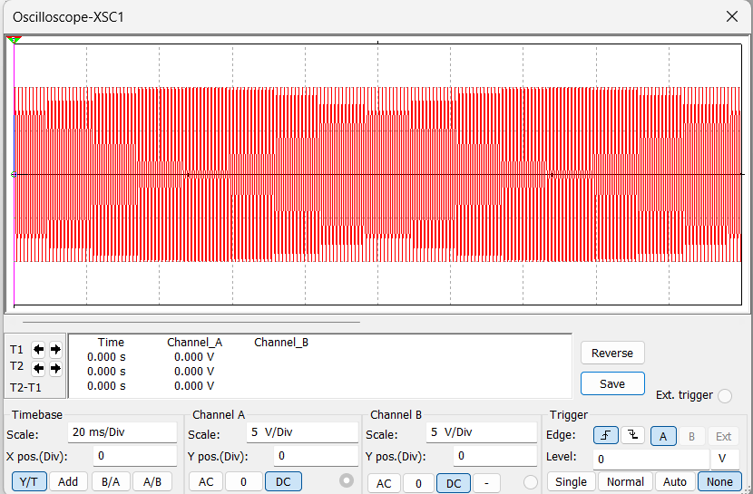
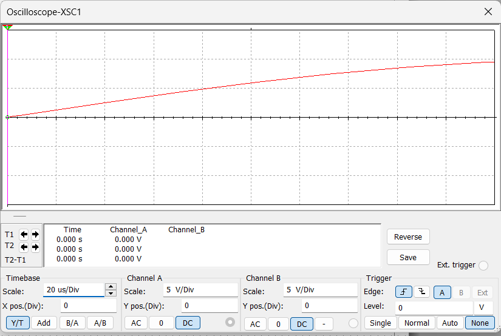
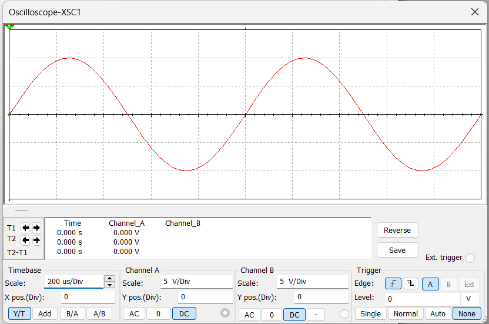

- При визуальном анализе дискретно полученных данных часто требуется привести частоту получения этих данных, с частотой их появления.
- К примеру на рисунке, представлена ситуация, в которой частота дискретизации значительно выше частоты измеряемого сигнала. Из графика можно определить только величину амплитуды, но определить значение периода и частоты в данном случае будет сложно.
- 
-
- Обратная ситуация представлена на рисунке. В данном случае никакой полезной информации при такой частоте дискретизации получить невозможно, так как нет полной картины графика.
- 
-
- Идеальная ситуация представлена на рисунке. Частота дискретизации и частота сигнала соизмеримы,  поэтому сигнал равномерно проходит через деления графика.
- 
-
- При решении задачи изменения масштаба дискретизации существует два подхода.
- Первым из них является применение децимации и интреполяции. Их реализация возможна как с использованием цифровых методов обработки, так и при помощи специальных DSP микросхем. В таком варианте частота дискретизации остаётся постоянной.
- Для снижения частоты применяется децимация, суть её состоит в том, чтобы выборочно исключить данные, которые не входят в желаемую частоту дискретизации, из выборки.
- http://jre.cplire.ru/jre/jun10/1/text.html
- Обратная операция возможна при помощи интерполяции. На основе уже известных точек строится некоторая модель данных, на основе которой строятся данные.
- https://help.qlik.com/ru-RU/cloud-services/Subsystems/Hub/Content/Sense_Hub/AutoML/extrapolation-interpolation.htm
- Минус данного подхода заключется в том, что результирующие данные будут далеки от фактических, например измеряемый сигнал обладает шумами, из-за чего модель данных попытается сгладить эти шумы, либо же намеренно их добавить. При децимации возможна ошибка соотношений прореживаемых данных, частота дискретизации и желаемая частота при соотношении может убрать из выборки нужные данные.
-
- Второй способ изменения масштаба частоты дискретизации заключается в прямом изменении тактовой частоты системы сбора данных. Такая система реализуется только аппаратно, на основе программируемых генераторов тактовых сигналов. В таком случае представление данных всегда соответствует измеряемой величине. К минусам такой системы можно отнести проблему передачи данных на маломощные устройства, так как их собственная тактовая частота может быть в разы меньше, чем тактовая частота системы сбора, поэтому следует в узлах передачи данных устанавливать сдвиговые регистры, которые будут выполнять роль буфера.