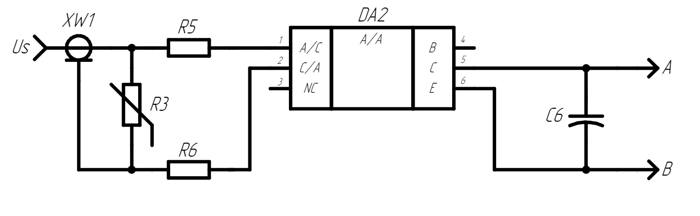

- Исходя из поставленной задачи значения измерямых сигналов во много раз выше максимально допустимых значений в измерительных элементах
- Поэтому в схеме предусмотрена схема обвязки на варисторе и опторазвязке.
- При измерении напряжений больших, чем 100 В сработает варистор R3, через который всё дальнейщее напряжение будет направлено через него. В случаях короткого замыкания или любого другого случая нарущающего нормальную работу измерительного устройства пострадает только оптопара, выполняющая предохранительную задачу в данной схеме.
- 