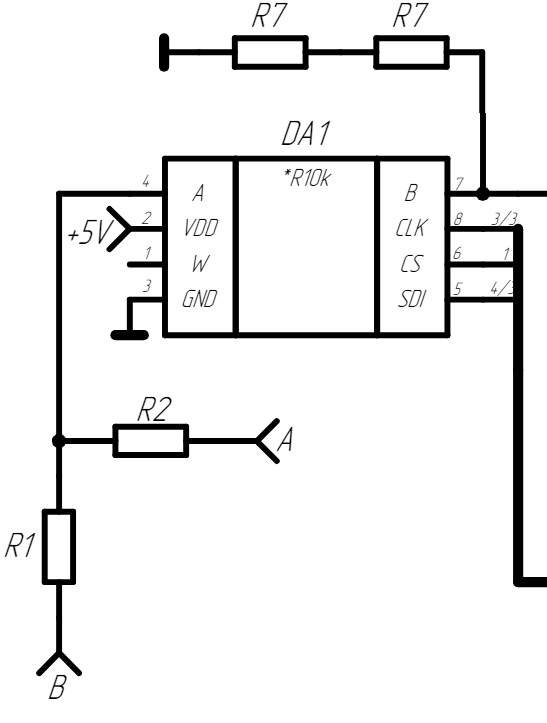

- На рисунке 3.1 представлена схема входного делителя и регулируемого делителя.
- Резисторы R1 и R2 делят напряжение на половину, для того чтобы увеличить диапазон его входного
  напряжения, который составляет 50 В. R1, R2 имеют одинаковым сопротивлением каждый по 100 Ом и допуском ±1%.
- Далее связка DA1, R7, R8, представляющая из себя делитель соотношением c регулируемым соотношением от 1:1 до 1:20.
- Сопротивление микросхема DA1 управляется микронтроллером по средством протокола SPI.
- {:height 731, :width 547}
-