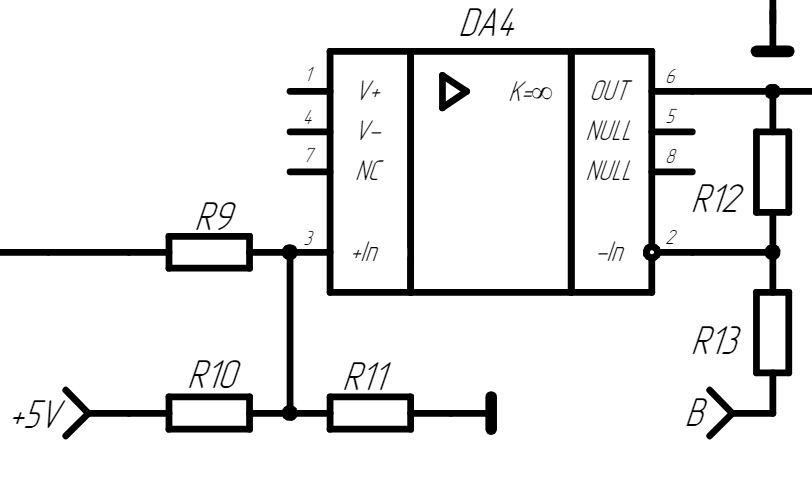
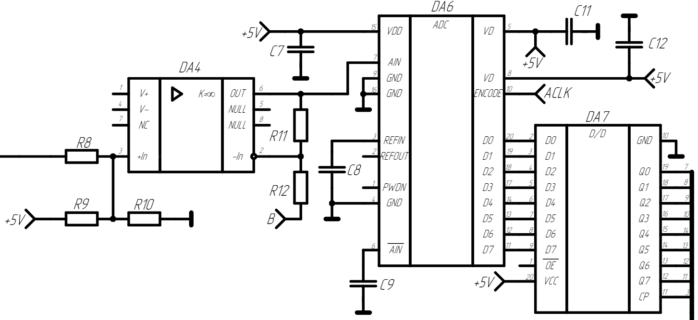
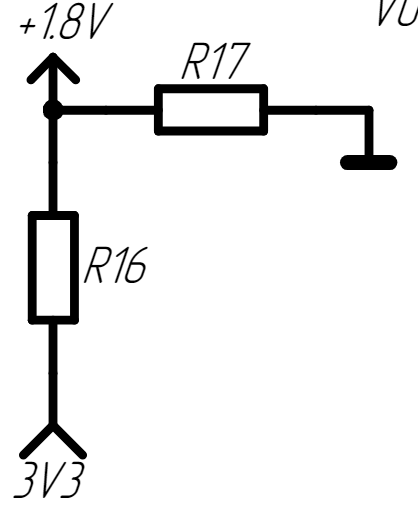
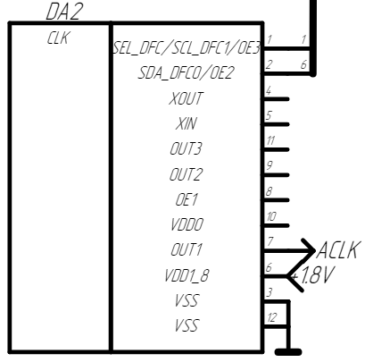

- У аналогового-цифрового преобразователя предел измерения от 0 до 5 вольт. поэтому измерямый сигнал нужно сместить на 2.5 вольт, чтобы равномерно использовать весь предел цифрового преобразователя.
- На рисунке представлена схема сумматор сигнала, который суммируется с поделённым после входного делителя измеряемым сигналом и источником напряжения 5 В поделёным резисторами наполовину.
- [Вот тут должен быть расчёт сумматора исходя из максимальных входных](https://www.ruselectronic.com/summator/#:~:text=%D0%BD%D0%B5%D0%B8%D0%BD%D0%B2%D0%B5%D1%80%D1%82%D0%B8%D1%80%D1%83%D1%8E%D1%89%D0%B8%D0%B9%20%D1%81%D1%83%D0%BC%D0%BC%D0%B0%D1%82%D0%BE%D1%80.-,%D0%9D%D0%B5%D0%B8%D0%BD%D0%B2%D0%B5%D1%80%D1%82%D0%B8%D1%80%D1%83%D1%8E%D1%89%D0%B8%D0%B9%20%D1%81%D1%83%D0%BC%D0%BC%D0%B0%D1%82%D0%BE%D1%80,-%D0%91%D0%B0%D0%B7%D0%BE%D0%B2%D0%B0%D1%8F%20%D1%81%D1%85%D0%B5%D0%BC%D0%B0%20%D0%B1%D1%83%D0%B4%D0%B5%D1%82)
- 
-
- Просуммированный с 2.5 вольт сигнал отправляется на АЦП, где уже и переводится в цифровое 8 битное значение. Скорость обработки аналогового сигнала в максимуме составляет 100 МГц, техничениские характеристики ATmega328P 16 MHz, что намного меньше измерямого сигнала, поэтому после вывода АЦП установлено хранилище данных, которое выполняет роль синхронизиронизированного с внешним приёмником данных буфера.
- 
-
- Также что касается ATMega328P частоты дискретизации встроенного тактового счётчика не хватит, чтобы использовать плату AD9283 на полную частотную мощность. Для создания тактовых импульсов в схеме имеется внешний управляемый генератор тактовых импульсов на базе 5L2503 от MicroClock. Микросхема питается от напряжения 1.8 В, поэтому в добавок к ней в схеме имеется делитель напряжения от 3.3 В на 1.8 В. Тактовая частота управляется микронтроллером по средством протокола I2C.
- 
- 