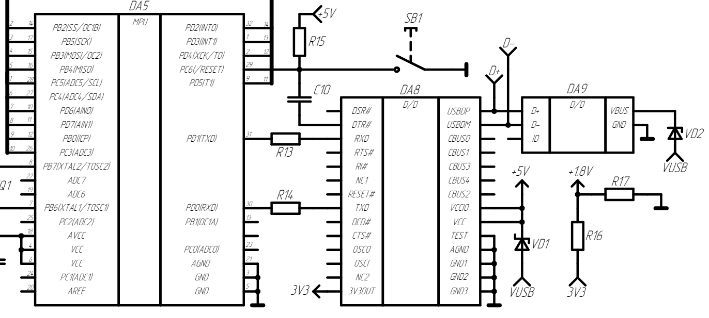

- Для взаимодействие с внешними устройствами к миконтроллеру подключен преобразователь интерфейсов FT232RL, он же DA8, и штекерный вывод micro USB.
- DA8 позволяет переводит данные с интерфеса UART микронтроллера на USB, так и обратно.
- Внешнее подключаемое устройство помимо обмена данных с ATMega328 будет также осуществлять функцию источника питания, через тот же интерфейс USB
-
- Так же на рисунке представлен функционал перезагрузки платы:
	- Через преобразователь и порт DTR#
	- И через внешнюю кнопку SB1
- При логической единице на пине PC6(/RESET) плата будет перезагружена.
-
- Отключение платы осуществляется либо физическим способом, путём отключения устройства, либо программным - отключение функции OTG на уровене внешнего подключаемого устройства.
- 