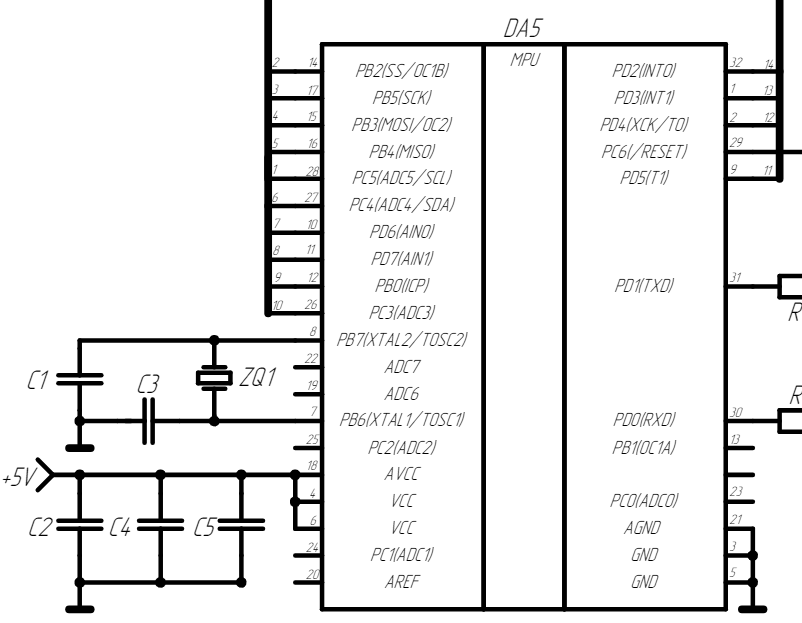

- Шина на которой подключены все управляемые устройства ведётся к микроконтроллеру, с которого и ведётся всё дальнейшее чтение данных с буферного регистра и управление периферийными устройствами.
- 
-